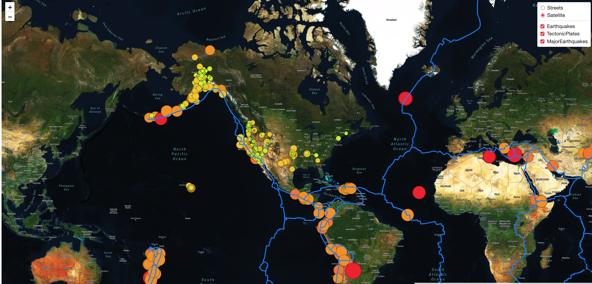

# Mapping Earthquakes
## Overview of the Project

   Used JavaScript and HTML with API to visualize the earthquake data. Uses Leaflet's library and Mapbox's API to populate a geographical map with GeoJSON earthquake data.

## Instruction
Create a Mapbox account:
* Visit mapbox.com, create a [Mapbox](https://www.mapbox.com/) account and retrieve the access token.
* Copy the token key, then paste it in config.js after <b>API_KEY=</b>
* Run the web page:
    - Open the command line.
    - Navigate to the folder.

    enter <b>python -m http.server 5597</b>.
    Then click [http://[::]:5597/](http://[::]:5597/)

## Demo

### user can choose Streets view or Satellite view, and select and de-select Earthquake data and TectonicPlates data using the checkbox on the upper right corner.

